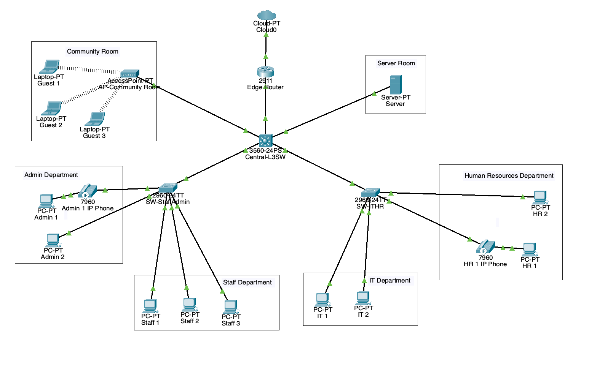

# Layer 3 Switched Office Network with VLANs and Guest WiFi

## Project Overview
This project is a Cisco Packet Tracer office network built around a **Layer 3 switch** as the core routing device. Unlike my previous router-focused project, this lab emphasizes **SVI-based inter-VLAN routing**, **centralized switching**, **guest Wi-Fi isolation**, **voice VLANs**, **access-layer security**, and **edge NAT connectivity**.

The topology includes:

- Community Room / Guest Wi-Fi
- Server Room
- Admin Department
- Staff Department
- IT Department
- Human Resources Department
- Central Layer 3 Switch
- Two access-layer switches
- Edge Router connected to the ISP/Cloud

---

## Topology

## Files Included
- `Layer-3-Switched-Office-Network-with-VLANs-and-Guest-WiFi.pkt` → Packet Tracer file
- `TopologyDiagram2.png` → network topology image
- `README.md` → project documentation

---

## Network Segmentation

| VLAN | Department / Segment | Network |
|---:|---|---|
| 10 | Server Room | `192.168.10.0/24` |
| 20 | Community Room / Guest Wi-Fi | `192.168.20.0/24` |
| 30 | Admin Department | `192.168.30.0/24` |
| 40 | Staff Department | `192.168.40.0/24` |
| 50 | IT Department | `192.168.50.0/24` |
| 60 | Human Resources Department | `192.168.60.0/24` |
| 99 | Management VLAN | `192.168.99.0/24` |
| 110 | Voice VLAN | `192.168.110.0/24` |

### Transit Network
- `10.10.10.0/24` → Central-L3SW to Edge Router

---

## Core Design
The network is centered on a **3560 multilayer switch** that performs:

- SVI-based routing on a multilayer switch instead of internal OSPF-based routing
- VLAN gateway termination through **SVIs**
- **inter-VLAN routing** using `ip routing`
- **DHCP relay** with `ip helper-address`
- **guest traffic control** using ACLs
- default routing toward the edge router

This makes the project distinct from my first project, which relied more heavily on routers, OSPF, and Router-on-a-Stick.

---

## DHCP, DNS, and Server Services
The server in the Server Room uses the static IP:

- **Server:** `192.168.10.10`

Enabled services:
- **DHCP**
- **DNS**
- **HTTP**
- **HTTPS**

Separate DHCP pools were created for all VLANs, including the **Voice VLAN**.  
Because the DHCP server is located in VLAN 10, `ip helper-address 192.168.10.10` was configured on the other SVIs.

---

## Switching Architecture
Two 2960 access switches were used:

- **SW-StaffAdmin**
- **SW-ITHR**

These connect to the central Layer 3 switch through **802.1Q trunk links**.

### Management VLAN
A dedicated management VLAN was implemented:

- Central-L3SW → `192.168.99.1`
- SW-StaffAdmin → `192.168.99.2`
- SW-ITHR → `192.168.99.3`

This separates management traffic from user traffic.

---

## Inter-VLAN Routing
Inter-VLAN routing is performed directly on the multilayer switch using **SVIs**, rather than router subinterfaces.

This project therefore demonstrates a **Layer 3 switching design** instead of a **Router-on-a-Stick** design.

---

## Guest Wi-Fi Isolation
The Community Room contains an access point and wireless guest clients in **VLAN 20**.

An extended ACL was applied to the guest VLAN so that:

- guests **cannot reach internal office subnets**
- guests **can still reach external destinations**

This creates a realistic **guest-to-internet-only** policy.

---

## Voice VLAN
A dedicated **Voice VLAN 110** was created for the IP phones in the Admin and Human Resources departments.

- **Voice VLAN:** 110
- **Gateway:** `192.168.110.1`

Ports with both a phone and a PC were configured with:
- a data VLAN for the PC
- a voice VLAN for the phone

A dedicated DHCP pool was also created for voice devices.

---

## Access Layer Security
Security features were added on access ports, including:

- **Port Security**
- **Sticky MAC learning**
- **PortFast**
- **BPDU Guard**

Ports with both a phone and a PC were configured with a higher secure MAC limit than standard PC-only ports.

---

## Edge Router and NAT
An edge router provides internet access through the ISP/Cloud.

### WAN Interface
The external router interface obtains its address dynamically from the ISP using:
ip address dhcp

Routing
	•	Central-L3SW default route → 10.10.10.1
	•	Edge Router return route → 192.168.0.0/16 via 10.10.10.2

NAT
	•	PAT / NAT overload was configured for internal client access
	•	Static NAT was configured for the internal web server

Static NAT mapping:
	•	Inside Local: 192.168.10.10
	•	Inside Global: 203.0.113.10

This allows internal users to access the internet while also publishing the internal web server externally.

⸻

## SSH and Device Hardening

SSH was configured for switch management using:
	•	hostname
	•	local username
	•	domain name
	•	RSA key generation
	•	SSH version 2
	•	VTY lines restricted to SSH

## Additional hardening included:

- `service password-encryption`
- `enable secret`
- `banner motd`

⸻

## Key Features Implemented

- Layer 3 switch-based inter-VLAN routing
- VLAN segmentation by department
- Centralized DHCP and DNS services
- DHCP relay with `ip helper-address`
- Guest Wi-Fi access
- Guest network isolation with ACL
- Management VLAN
- Voice VLAN for IP phones
- Port security with sticky MAC
- PortFast and BPDU Guard
- PAT for internal clients
- Static NAT for the web server
- HTTP/HTTPS hosting
- SSH management and device hardening

⸻

## Skills Demonstrated

This project demonstrates hands-on experience with:
	•	Layer 2 and Layer 3 switching
	•	VLAN and SVI design
	•	Inter-VLAN routing on a multilayer switch
	•	DHCP and DHCP relay
	•	DNS and web service configuration
	•	Wireless guest segmentation
	•	Voice VLAN implementation
	•	Access-layer security
	•	NAT/PAT and static NAT
	•	Secure remote management with SSH
	•	Office / campus-style LAN design

⸻

## Author

Built as a networking portfolio project to demonstrate practical Layer 3 switching, VLAN segmentation, wireless guest isolation, access-layer security, centralized services, and edge connectivity in Cisco Packet Tracer.
